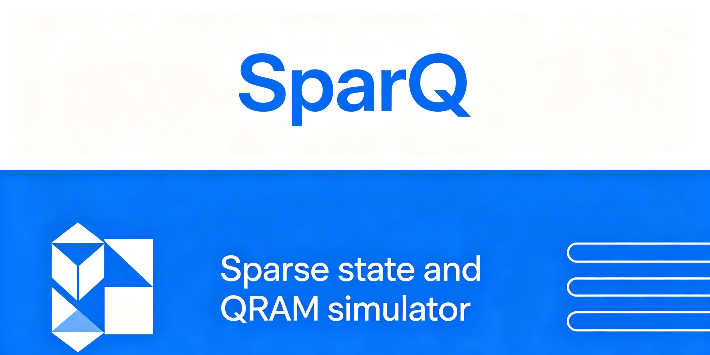

<p align="center">
  
</p>

# QRAM-Simulator & PySparQ

[](https://arxiv.org/abs/2503.13832)
[](https://arxiv.org/abs/2503.15118)
[](https://pypi.org/project/pysparq/)
[](https://opensource.org/licenses/Apache-2.0)
[](https://github.com/IAI-USTC-Quantum/QRAM-Simulator)
[](https://iai-ustc-quantum.github.io/QRAM-Simulator/)
[](https://iai-ustc-quantum.github.io/)
[](https://github.com/IAI-USTC-Quantum/QRAM-Simulator/actions/workflows/cmake-multi-platform.yml)

> **稀疏态量子模拟器，支持 Register Level Programming**

## 双软件架构

本仓库包含两个紧密协作的软件组件，面向不同的用户群体和使用场景：

| 软件 | 定位 | 用户群体 | 核心优势 |
|------|------|----------|----------|
| **QRAM-Simulator** | C++ 稀疏态量子模拟器核心 | 研究人员、高性能计算开发者 | 极致性能、精细控制 |
| **PySparQ** | Python 绑定与高层次 API | 量子算法开发者、教育工作者 | 快速原型、易于上手 |

- **QRAM-Simulator**: 提供底层的稀疏态量子模拟能力，包括量子随机存取存储器 (QRAM) 模拟、量子算术运算、噪声模型等。适用于需要深度优化和高性能的场景。
- **PySparQ**: 通过 pybind11 将 C++ 核心能力暴露给 Python，提供简洁的 API 用于快速开发和验证量子算法。

## Register Level Programming（核心特性）

### 根本性差异

传统量子框架与 SparQ 的核心区别：

| 维度 | 传统方式 | Register Level Programming |
|------|----------|---------------------------|
| **状态存储** | 量子比特数组/张量网络 | `uint64_t` 直接存储寄存器值 |
| **算术运算** | 编译成量子门序列 | 直接对寄存器值进行算术操作 |
| **开发模式** | 自底向上（从门电路构建） | 自顶向下（先写高层模块再细化） |
| **QAdder 实现** | 分解为数百个量子门 | 直接调用加法器，自动门分解 |

### 自顶向下开发流程

```
传统方式：                        SparQ 方式：
┌──────────────┐                 ┌──────────────┐
│ 量子门序列   │                 │ 高层算法模块 │ ← 先写这里
│   ↓ ↓ ↓     │                 │   ↓ 细化    │
│ 振幅计算    │                 │ 寄存器操作   │
└──────────────┘                 │   ↓ 验证    │
                                 │ 回归测试    │
                                 └──────────────┘
```

### 代码示例对比

**传统框架 (Qiskit)**：
```python
# 需要手动构建加法器门电路
adder = DraperQFTAdder(num_state_qubits=4)
circuit.append(adder, [0, 1, 2, 3, 4, 5, 6, 7])
```

**PySparQ**：
```python
import pysparq as ps

# 直接创建寄存器并执行加法
state = ps.SparseState()

# 添加寄存器（返回寄存器 ID）
a_id = ps.AddRegister("a", ps.UnsignedInteger, 4)(state)
b_id = ps.AddRegister("b", ps.UnsignedInteger, 4)(state)

# QAdder 直接操作寄存器值，无需编译成门序列
# 将 a + b 存储到输出寄存器
out_id = ps.AddRegister("out", ps.UnsignedInteger, 5)(state)
ps.Add_UInt_UInt("a", "b", "out")(state)
```

## 与主流量子框架对比

| 特性 | QRAM-Simulator/PySparQ | Qiskit | Cirq | PennyLane |
|------|------------------------|--------|------|-----------|
| **状态表示** | 稀疏态（仅非零振幅） | 稠密态/张量网络 | 稠密态 | 混合态/自动微分 |
| **编程模型** | Register Level | 门序列 | 门序列 | 可微分编程 |
| **模拟规模** | 可达 64+ 量子比特（特定结构） | 通常 20-30 量子比特 | 类似 Qiskit | 类似 Qiskit |
| **算术电路** | 原生寄存器操作 | 需分解为门 | 需分解为门 | 需分解为门 |
| **QRAM 支持** | 原生支持 | 无原生支持 | 无原生支持 | 无原生支持 |
| **GPU 加速** | 暂时屏蔽（CPU-only） | 有限支持 | 有限支持 | 有限支持 |

### 何时使用 QRAM-Simulator？

✅ **适合使用**：
- 大规模量子算术电路（加法器、乘法器）
- 需要 QRAM 的量子算法（Grover、量子机器学习）
- 稀疏态结构的量子模拟
- 噪声模型研究

❌ **不适合使用**：
- 通用量子电路（门种类复杂、态稠密）
- 需要与真实量子硬件直接交互
- 变分量子算法（需要自动微分）

## PySparQ 快速开始

### 安装

```bash
pip install pysparq
```

**要求**：
- Python 3.10 – 3.13
- NumPy

**GPU 支持**：
- CUDA/GPU 后端当前在 CMake 中临时屏蔽，默认只构建 CPU 路径；等 CondRot primitive 重构稳定后再恢复。

### 5 分钟上手示例

```python
import pysparq as ps

# 1. 创建稀疏态
state = ps.SparseState()

# 2. 定义寄存器（Register Level Programming 的核心）
# AddRegister 返回寄存器 ID，用于后续操作
addr_id = ps.AddRegister("addr", ps.UnsignedInteger, 4)(state)
data_id = ps.AddRegister("data", ps.UnsignedInteger, 8)(state)

# 3. 初始化叠加态（所有地址等概率）- Register Level 特性
ps.Hadamard_Int("addr", 4)(state)  # 对 4-bit 寄存器应用 Hadamard
ps.print(state)  # Detail 模式：显示寄存器头和所有基态
# 输出：
# StatePrint (mode=Detail)
# |(0)addr : UInt4 | |(1)data : UInt8 |
# 0.250000+0.000000i  addr=|0> data=|0>
# 0.250000+0.000000i  addr=|1> data=|0>
# ...
# 0.250000+0.000000i  addr=|15> data=|0>
# 每个基态振幅 0.25（等概率叠加 16 个地址），数据寄存器均为 |0>

# 4. 创建 QRAM 并加载数据
memory = [i * 2 for i in range(16)]  # 16 个地址，每个 8-bit 数据
qram = ps.QRAMCircuit_qutrit(4, 8, memory)

# 5. 执行 QRAM 加载：|addr⟩|0⟩ → |addr⟩|memory[addr]⟩
ps.QRAMLoad(qram, "addr", "data")(state)
ps.print(state)
# 输出：
# StatePrint (mode=Detail)
# |(0)addr : UInt4 | |(1)data : UInt8 |
# 0.250000+0.000000i  addr=|0> data=|0>
# 0.250000+0.000000i  addr=|1> data=|2>
# 0.250000+0.000000i  addr=|2> data=|4>
# ...
# 0.250000+0.000000i  addr=|15> data=|30>
# 每个 addr 等概率幅 0.25，data = memory[addr] = addr × 2

# 6. 直接进行算术操作（无需编译成门！）
# data = data + 5，使用寄存器级别加法
ps.Add_ConstUInt("data", 5)(state)
ps.print(state)
# 输出：
# StatePrint (mode=Detail)
# |(0)addr : UInt4 | |(1)data : UInt8 |
# 0.250000+0.000000i  addr=|0> data=|5>
# 0.250000+0.000000i  addr=|1> data=|7>
# 0.250000+0.000000i  addr=|2> data=|9>
# ...
# 0.250000+0.000000i  addr=|15> data=|35>

# 7. 测量 - 打印状态概率分布
ps.print(state, mode=ps.StatePrintDisplay.Prob)
# 输出：每个基态的概率 p = 0.0625（1/16）
```

### Register Level 特性的关键 API

```python
# 量子算术 - 直接寄存器操作（Register Level Programming 核心）
ps.Add_UInt_UInt(in1, in2, out)      # out = in1 + in2
ps.Add_UInt_ConstUInt(reg, const)    # reg = reg + const
ps.Add_ConstUInt(reg, const)         # reg = reg + const（简化版）
ps.Mult_UInt_ConstUInt(in, c, out)   # out = in * c
ps.ShiftLeft(reg, n)                 # 左移 n 位
ps.ShiftRight(reg, n)                # 右移 n 位

# 基础量子门
ps.Hadamard_Int(reg, n_digits)       # 对整数寄存器应用 Hadamard
ps.Xgate_Bool(reg, pos)              # X 门（特定比特位）
ps.Zgate_Bool(reg, pos)              # Z 门

# QRAM 操作
ps.QRAMLoad(qram, addr_reg, data_reg)      # QRAM 加载
ps.QRAMLoadFast(qram, addr_reg, data_reg)  # 快速版本
```

## QRAM-Simulator C++ API

### 构建指南

```bash
# 克隆仓库
git clone https://github.com/Agony5757/QRAM-Simulator.git
cd QRAM-Simulator

# 创建构建目录
mkdir build && cd build

# 配置（CPU 版本）
cmake .. -DCMAKE_BUILD_TYPE=Release

# GPU/CUDA 后端当前暂缓，CMake 会构建 CPU-only 版本

# 编译
make -j$(nproc)
```

### 核心概念

```cpp
#include "SparQ/include/sparse_state_simulator.h"

using namespace qram_simulator;

// 1. 创建稀疏态
SparseState state;

// 2. 声明寄存器
auto addr_id = AddRegister("addr", UnsignedInteger, 4)(state);  // 4-bit 地址
auto data_id = AddRegister("data", UnsignedInteger, 8)(state);  // 8-bit 数据

// 3. 初始化寄存器（指定值）
Init_Unsafe("addr", 3)(state);
Init_Unsafe("data", 5)(state);

// 4. 应用操作（Register Level!）
Hadamard_Int_Full(addr_id)(state);        // 叠加态：|3⟩ → (|0⟩+|1⟩+...+|15⟩)/√16
(StatePrint(Detail))(state);
// 输出：16 个叠加态，每个基态振幅 0.25

Add_UInt_UInt(addr_id, data_id, addr_id)(state);  // addr = addr + data = 3+5 = 8
(StatePrint(Detail))(state);
// 输出：addr=|8>, data=|5>, 所有振幅 1.0
```

### 核心组件

- **SparseState**: 稀疏态存储与操作
- **System**: 寄存器管理和系统配置
- **Operators**: 量子操作（门、算术、QRAM）
  - `basic_gates.h`: 基础量子门
  - `quantum_arithmetic.h`: 量子算术（加减乘除、移位）
  - `qram.h`: QRAM 加载操作
  - `qft.h`: 快速傅里叶变换（优化实现）

### 运行实验

```bash
# QRAM 保真度实验
./build/bin/Experiment_QRAM_Fidelity \
    --addrsize 15 --datasize 3 \
    --shots 100 --inputsize 10 \
    --depolarizing 1e-4 --damping 1e-5 \
    --seed 123456 --version normal
```

## 开发量子算法

详细的量子算法开发指南见 [docs/sphinx/source/guide/development/](docs/sphinx/source/guide/development/)，包括：

- Register Level Programming 核心概念
- C++/Python 开发模板
- 添加新实验的步骤
- 测试验证清单
- 代码规范

## 论文与引用

本仓库由两篇论文分别驱动，各自贡献了不同的核心能力：

### Paper 1: QRAM-Simulator — [arXiv:2503.13832](https://arxiv.org/abs/2503.13832)

> *Efficient Simulation of Quantum Random Access Memory*

面向 QRAM 模拟的稀疏态量子模拟器，提出了 **Register Level Programming** 范式。主要贡献：

- **QRAM 电路模拟**：Qutrit-based 与 Qubit-based 两种 QRAM 实现（C++ API），支持退极化和振幅阻尼噪声模型。PySparQ 仅提供 qutrit 版本。
- **Register Level Programming**：以 `uint64_t` 寄存器直接存储替代逐门构建，支持自顶向下的量子算法开发
- **稀疏态优化**：仅存储非零振幅，可实现 64+ 量子比特的结构化算法模拟
- **错误过滤**：针对含噪 QRAM 的错误过滤方案

**对应代码**：`QRAM/`、`Experiments/QRAM/`、`Experiments/ErrorFiltration/`

### Paper 2: SparQ — [arXiv:2503.15118](https://arxiv.org/abs/2503.15118)

> *SparQ: A Sparse Quantum Circuit Simulator with Register-Level Abstraction*

将 Register Level Programming 拓展为通用稀疏态量子模拟器，并提供 Python 接口。主要贡献：

- **通用稀疏态模拟器**：支持 QFT、Grover、哈密顿量模拟、量子微分算法（QDA）、QCNN 等多种算法
- **PySparQ**：通过 pybind11 提供完整 Python API，`pip install pysparq` 即可使用
- **扩展算法库**：状态准备、块编码、量子游走、线性系统求解等高层算法
- **CPU-only 构建**：CUDA/GPU 后端当前暂时屏蔽，待 CondRot primitive 重构稳定后恢复

**对应代码**：`SparQ/`、`SparQ_Algorithm/`、`PySparQ/`、`Experiments/QFT/`、`Experiments/Grover/`、`Experiments/QDA/`、`Experiments/QCNN/`

### BibTeX

```bibtex
@article{sun2025sparqsim,
  title={SparQSim: Simulating Scalable Quantum Algorithms via Sparse Quantum State Representations},
  author={Sun, Tai-Ping and Chen, Zhao-Yun and Wang, Yun-Jie and Xue, Cheng and Liu, Huan-Yu and Zhuang, Xi-Ning and Xu, Xiao-Fan and Wu, Yu-Chun and Guo, Guo-Ping},
  journal={arXiv preprint arXiv:2503.15118},
  year={2025}
}

@article{wang2025refined,
  title={Refined Criteria for QRAM Error Suppression via Efficient Large-Scale QRAM Simulator},
  author={Wang, Yun-Jie and Sun, Tai-Ping and Zhuang, Xi-Ning and Xu, Xiao-Fan and Liu, Huan-Yu and Xue, Cheng and Wu, Yu-Chun and Chen, Zhao-Yun and Guo, Guo-Ping},
  journal={arXiv preprint arXiv:2503.13832},
  year={2025}
}
```

### 复现论文结果

详细的实验复现指南见 [docs/paper/](docs/paper/) 目录：

- [docs/paper/README.md](docs/paper/README.md) - 论文关联文档
- [docs/paper/reproduction.md](docs/paper/reproduction.md) - [QRAM-Simulator](https://arxiv.org/abs/2503.13832) 实验复现指南

## 项目结构

```
QRAM-Simulator/
├── SparQ/              # C++ 稀疏态模拟器核心
│   ├── include/        # 头文件（运算符、系统操作）
│   └── src/            # 源文件
├── QRAM/               # QRAM 电路实现
│   └── include/        # Qutrit-based QRAM
├── PySparQ/            # Python 绑定
│   └── pysparq/        # Python 包
├── SparQ_Algorithm/    # 高层算法（状态准备、块编码等）
├── Experiments/        # 论文实验代码
│   └── QRAM/           # QRAM 相关实验
├── test/               # 单元测试
└── docs/               # 文档
    └── paper/          # 论文复现文档
```

## 基于 PySparQ 的量子算法实现

本节详细记录 PySparQ 如何将 SparQ 的量子算法实验代码（C++）逐一转译为 Python 实现，涵盖代码与量子算法步骤的精确对应关系、寄存器长度管理策略，以及各子模块的实现流程。

### 一、覆盖率总览：C++ 实验 vs PySparQ 实现

| 算法 | C++ 实验代码 | PySparQ 实现文件 | 对应状态 |
|------|------------|----------------|--------|
| **Grover** | `Experiments/Grover/GroverTest.cpp` | `PySparQ/pysparq/algorithms/grover.py` | ✅ 完整复刻 |
| **Shor** | `Experiments/Shor/ShorTest.cpp` | `PySparQ/pysparq/algorithms/shor.py` | ✅ 完整复刻 |
| **QDA** | `Experiments/QDA/QDATest/QDATest.cpp` | `PySparQ/pysparq/algorithms/qda_solver.py` | ✅ primitive 级转译，解读出后处理待补 |
| **CKS** | `Experiments/CKS/HamiltonianSimulationTest.cpp` | `PySparQ/pysparq/algorithms/cks_solver.py` | ✅ primitive 级转译，LCU 解读出后处理待补 |
| **QFT** | `Experiments/QFT/QFTTest.cpp` | ❌ 无独立模块 | ❌ 尚未实现 |
| **GHZ** | `Experiments/GHZ/GHZTest.cpp` | ❌ 无 | ❌ 尚未实现 |
| **QCNN** | `Experiments/QCNN/QCNNTest.cpp`（已被 `#if false` 禁用） | ❌ 无 | ❌ 尚未实现 |

**关键发现：**
- Grover 和 Shor 实现了完整的一一对应，是目前 PySparQ 算法库中最完整的两个实现
- QDA 和 CKS 的 Python 实现不直接调用 C++ solver，而是组合 PySparQ 底层 primitive 来复刻 C++ 的寄存器级流程；当前未完成的是测量、post-selection 和线性系统解向量读出
- QFT、GHZ 的 C++ 实现较简单，可作为接下来补全的优先目标
- QCNN 在 C++ 侧已被禁用，需要先在 C++ 侧恢复再转译到 Python

---

### 二、Register Level Programming 在量子算法中的通用模式

在深入各算法之前，先总结 PySparQ 实现量子算法时的通用寄存器管理模式。

#### 2.1 寄存器角色分工

每个量子算法均需定义以下几类寄存器，理解它们的角色是理解实现细节的关键：

| 寄存器类型 | 命名模式 | 长度（比特） | 作用 |
|-----------|---------|------------|------|
| **主数据寄存器** | `"main"`, `"addr"` | `log₂(N)`（N 为问题规模） | 存储算法主输入，如搜索空间地址 |
| **数据寄存器** | `"data"` | 视数据范围而定，通常 64 | 临时存放 QRAM 读取的数据 |
| **搜索值寄存器** | `"target"`, `"search"` | 与 data 相同 | 存放要搜索/匹配的目标值 |
| **辅助 Ancilla 寄存器** | `"anc_1"`, `"anc_2"` 等 | 1 或与主寄存器相同 | 控制流、标记位、条件反射 |
| **精度寄存器** | `"count"`, `"work_reg"` | 2×n（n 为主寄存器宽度） | 相位估计、迭代计数 |

#### 2.2 寄存器长度的选取原则

```
主寄存器宽度 = ceil(log2(问题规模 N))
数据寄存器宽度 = 64（默认值，足够容纳浮点数量化后的整数）
精度寄存器宽度 = 2 × ceil(log2(N))  ← 主要用于 Shor 算法的相位估计
```

在 `grover.py` 中（第 256–283 行）：
```python
n_bits = int(math.log2(n)) + 1 if n > 0 else 1   # 地址寄存器宽度
data_reg = ps.AddRegister("data", ps.UnsignedInteger, data_size)(state)  # 数据寄存器固定64位
```

#### 2.3 通用量子操作模式

几乎所有算法都遵循以下操作模式：

```python
# ① 清理系统
ps.System.clear()

# ② 创建量子态
state = ps.SparseState()

# ③ 添加寄存器（链式调用，返回寄存器 ID）
addr_reg = ps.AddRegister("addr", ps.UnsignedInteger, n_bits)(state)

# ④ 初始化（叠加态 / 指定值）
ps.Hadamard_Int_Full("addr")(state)    # 全叠加
ps.Init_Unsafe("target", target)(state)  # 指定值

# ⑤ 算法主体（Oracle / Walk / 量子门序列）
grover_op(state)  # 或 walk_op(state)

# ⑥ 测量（偏迹）
measured_results, prob = ps.PartialTrace([...Registers...])(state)
```

---

### 三 Grover 量子搜索算法

#### 3.1 算法概述与数学原理

Grover 算法用于在 N 个无序条目中搜索 M 个标记项，复杂度为 O(√(N/M))，相比经典 O(N) 有平方加速。

核心迭代：
```
G = D · O
```
其中 Oracle O 标记目标态（加负相位），扩散算子 D 放大振幅。

#### 3.2 C++ 实现 → Python 的精确对应

C++ 测试（`GroverTest.cpp`，第 272–355 行）的核心逻辑与 `grover.py` 的对应关系：

| C++ 代码（GroverTest.cpp） | PySparQ 实现（grover.py） | 说明 |
|--------------------------|--------------------------|------|
| `qram_qutrit::QRAMCircuit qram(...)` | `ps.QRAMCircuit_qutrit(n_bits, data_size, memory)` | 量子随机存取存储器建立 |
| `System::add_register("addr", UnsignedInteger, addr_size)` | `ps.AddRegister("addr", ps.UnsignedInteger, n_bits)(state)` | 地址寄存器添加 |
| `Init_Unsafe("target", search_target)(state)` | `ps.Init_Unsafe("search", target)(state)` | 搜索目标初始化 |
| `Hadamard_Int_Full(qram_addr_reg)(state)` | `ps.Hadamard_Int_Full("addr")(state)` | 创建等幅叠加态 |
| `GroverOperator(&qram, ...)(state)` | `GroverOperator(qram, "addr", "data", "search")(state)` | 完整 Grover 迭代 |
| `PartialTrace` | `ps.PartialTrace([...])(state)` | 偏迹获取测量结果 |

#### 3.3 Oracle 的实现细节（代码行级对应）

C++ GroverTest.cpp 中无显式 Oracle 注释，但 `grover.h`（SparQ_Algorithm）定义了 `GroverOracle` 结构，对应 Python 实现如下：

**第 82–113 行（Oracle 工作流程）：**

```python
def __call__(self, state: ps.SparseState) -> None:
    # Step 1: QRAMLoad → |addr⟩|0⟩ → |addr⟩|memory[addr]⟩
    ps.QRAMLoad(self.qram, self.addr_reg, self.data_reg)(state)

    # Step 2: 创建比较标志寄存器（less / equal）
    compare_less  = ps.AddRegister("compare_less",  ps.Boolean, 1)(state)
    compare_equal = ps.AddRegister("compare_equal", ps.Boolean, 1)(state)

    # Step 3: 比较 data 与 target，产生 less/equal 标志
    ps.Compare_UInt_UInt(
        self.data_reg, self.search_reg, compare_less, compare_equal
    )(state)

    # Step 4: 匹配时加负相位（标记）
    phase_flip = ps.ZeroConditionalPhaseFlip([compare_equal])
    phase_flip(state)

    # Step 5: 反比较（反操作，清理辅助寄存器）
    ps.Compare_UInt_UInt(
        self.data_reg, self.search_reg, compare_less, compare_equal
    )(state)

    # Step 6: 删除临时寄存器
    ps.RemoveRegister(compare_equal)(state)
    ps.RemoveRegister(compare_less)(state)

    # Step 7: QRAMLoad 自反操作（QRAMLoad² = I）
    ps.QRAMLoad(self.qram, self.addr_reg, self.data_reg)(state)
```

**关键设计决策：**
- **三步式相位标记**：QRAMLoad → Compare → PhaseFlip → Uncompute → QRAMLoad，实现了无 ancilla 污染的相位 oracle
- **Compare_UInt_UInt**：PySparQ 直接对两个寄存器值做比较，生成布尔标志位，无需编译成量子门序列——这是 Register Level Programming 的核心优势
- **临时寄存器管理**：每次 Oracle 调用都会临时创建 `compare_less/equal`，使用后立即 RemoveRegister，避免状态空间膨胀

#### 3.4 扩散算子的实现细节（第 116–171 行）

```python
def __call__(self, state: ps.SparseState) -> None:
    ps.Hadamard_Int_Full(self.addr_reg)(state)   # H
    phase_flip = ps.ZeroConditionalPhaseFlip([self.addr_reg])  # P_0
    phase_flip(state)                     # 对 |0⟩ 加相位
    ps.Hadamard_Int_Full(self.addr_reg)(state)   # H
```

数学上：`D = H · P_0 · H = 2|s⟩⟨s| - I`（关于均匀叠加态的反射）

#### 3.5 GroverIterator 的完整流程（第 173–222 行）

```python
def __call__(self, state: ps.SparseState) -> None:
    # 每次迭代：Oracle → Diffusion
    self.oracle(state)       # 标记
    self.diffusion(state)    # 振幅放大
```

对应 C++ 测试中的循环（第 319–324 行）：
```cpp
for (size_t i = 0; i < n_repeats * 4; ++i) {
    auto qram_data_reg = AddRegister("data", UnsignedInteger, data_size)(state);
    GroverOperator(&qram, qram_addr_reg, qram_data_reg, search_data_reg)(state);
    (RemoveRegister(qram_data_reg))(state);   // 每次迭代后清理临时 data 寄存器
}
```

#### 3.6 量子计数 GroverCount 的实现（第 314–384 行）

对应 C++ `grover_count_success_test`（第 449–503 行）：

| C++ 代码 | Python 实现 |
|---------|-----------|
| `System::add_register("count", UnsignedInteger, count_precision)` | `ps.AddRegister("count", ps.UnsignedInteger, precision_bits)(state)` |
| `Hadamard_Int_Full(addr/count)` | `ps.Hadamard_Int_Full("count/addr")(state)` |
| `GroverCount(&qram, count_reg, ...)` | `GroverOperator(...).conditioned_by_bit("count", i)(state)` |
| 逆向 QFT `inverseQFT` | `ps.inverseQFT("count")(state)` |

---

### 四、Shor 量子因数分解算法

#### 4.1 算法概述

Shor 算法通过量子相位估计找到模幂运算的周期 r，从而将大数分解转化为求 gcd，在 RSA 加密等领域有重要应用。复杂度 O((log N)³)，相对经典的亚指数分解有指数加速。

核心流程：
```
1. 选择随机数 a (与 N 互素)
2. 量子相位估计：找最小 r 使得 a^r ≡ 1 (mod N)
3. 计算 gcd(a^(r/2)±1, N) 得到因子
```

#### 4.2 C++ 实现 → Python 的精确对应

C++ `ShorTest.cpp`（第 7–26 行）：
```cpp
semi_classical_shor(N);  // 核心调用，迭代 100 次
```

对应 Python `shor.py` 中的 `SemiClassicalShor` 类（第 241–331 行）：

| C++ 步骤 | Python 实现（shor.py） | 代码位置 |
|---------|----------------------|---------|
| 半经典迭代测量 | `SemiClassicalShor.run()` | 第 282–330 行 |
| 创建工作量子比特 | `ps.AddRegisterWithHadamard("work_reg", ps.UnsignedInteger, 1)` | 第 300–302 行 |
| 受控模幂运算 | `ModMul("anc_reg", a, size-1-x, N).conditioned_by_all_ones("work_reg")` | 第 306–307 行 |
| 相位校正 | `ps.Phase_Bool("work_reg", phase)` | 第 311–313 行 |
| Hadamard + 测量 | `ps.Hadamard_Bool("work_reg")` + `ps.PartialTrace` | 第 316–320 行 |
| 逆向 QFT（隐式在迭代测量中）| `shor_postprocess(meas, size, a, N)` | 第 329 行 |
| 经典后处理 | `shor_postprocess()` | 第 166–196 行 |

#### 4.3 模幂运算的实现（第 39–65 行、198–239 行）

C++ Shor 实现使用自定义量子算术模块。Python 对应实现：

```python
# 模幂函数（纯数学，第 39–65 行）
def general_expmod(a: int, x: int, N: int) -> int:
    """经典平方-乘算法：a^x mod N"""
    if x == 0: return 1
    if x & 1:  # 奇数
        return (general_expmod(a, x-1, N) * a) % N
    else:       # 偶数
        half = general_expmod(a, x // 2, N)
        return (half * half) % N

# 受控模乘算子（第 198–239 行）
class ModMul:
    def __call__(self, state: ps.SparseState) -> None:
        def modmul_func(val: int) -> int:
            return (val * self.opnum) % self.N
        op = ps.CustomArithmetic([self.reg], 64, 64, modmul_func)
        op.conditioned_by_all_ones(cond_reg)(state)
```

**关键设计：**
- `CustomArithmetic` 是 Register Level Programming 的极致体现——直接写 Python 函数描述整数到整数的映射，由 SparQ 自动编译为量子算术电路
- 无需手动构造受控-NOT 和单比特门组合

#### 4.4 半经典 Shor 的量子电路流程（第 282–330 行）

```
for x in range(size):           # size = 2 * n_bits(N)
    ① work_reg = |0⟩ + |1⟩           (通过 Hadamard)
    ② 受控模乘 a^(2^(size-1-x)) mod N (conditioned_by_all_ones on work_reg)
    ③ 相位校正 from prior results
    ④ Hadamard on work_reg
    ⑤ 测量 work_reg → result_bit
    ⑥ 移除 work_reg
    ↓
    合并 bits → meas_result (整数)
    ↓
    shor_postprocess → period r → factors p, q
```

#### 4.5 经典后处理（第 166–196 行）

```python
def shor_postprocess(meas: int, size: int, a: int, N: int) -> Tuple[int, int]:
    # ① 找最佳分数近似 y/Q
    r, c = find_best_fraction(y, Q, N)
    
    # ② 验证 r 的有效性（偶数、≠ -1 mod N）
    check_period(r, a, N)
    
    # ③ 提取因子
    a_exp_r_half = general_expmod(a, r // 2, N)
    p = math.gcd(a_exp_r_half + 1, N)
    q = math.gcd(a_exp_r_half - 1, N)
```

---

### 五、QDA 量子离散绝热线性系统求解器

#### 5.1 算法概述

QDA（Quantum Discrete Adiabatic）利用离散绝热定理求解线性系统 Ax = b，达到 O(κ log(κ/ε)) 的最优规模（κ 为条件数）。

PySparQ 版本按 C++ `Walk_s_Tridiagonal` 和 `Walk_s_via_QRAM` 的寄存器级结构实现：矩阵块编码、`StatePrepViaQRAM`、`Hadamard_Int_Full`、反射、受控旋转和全局相位都由 Python 侧调用底层 primitive 组合完成。它不会把整个 QDA solver 作为一个 C++ 绑定来绕过 Python 实现。当前 `qda_solve()` 会执行量子 walk 序列；由于测量和 post-selection 读出尚未接上，运行完成后会显式抛出 `RuntimeError`，避免用经典 `np.linalg.solve` 掩盖算法路径中的错误。

核心思路：
```
H(s) = (1-f(s))·H₀ + f(s)·H₁   （插值哈密顿量）
W_s = R · H_s                   （量子游走算子）
通过对 s 离散化执行 W_s 序列，使系统从 |b⟩ 演化到 |x⟩
```

#### 5.2 插值函数 f(s) 的实现（qda_solver.py 第 41–72 行）

```python
def compute_fs(s: float, kappa: float, p: float) -> float:
    """
    来自 PRX Quantum 论文 Eq.(69):
    f(s) = κ/(κ-1) * (1 - (1 + s(κ^(p-1) - 1))^(1/(1-p)))
    """
    if kappa == 1:
        return s
    kappa_p_minus_1 = kappa ** (p - 1)
    inner = 1 + s * (kappa_p_minus_1 - 1)
    exponent = 1 / (1 - p)
    result = kappa / (kappa - 1) * (1 - inner ** exponent)
    return max(0.0, min(1.0, result))
```

对应 C++ QDATest.cpp 第 410–413 行中的调用：
```cpp
WalkSequence_via_QRAM_Debug(&qram_A, &qram_b, mat, b, ...,
    steps, kappa, p, data_size, rational_size, ...)(state);
```

#### 5.3 块编码 H(s) 的实现（qda_solver.py 第 196–314 行）

`BlockEncodingHs` 类实现插值哈密顿量的块编码，对应 C++ 中的 `Walk_s_via_QRAM` 操作。核心操作序列（第 248–308 行）：

```python
def __call__(self, state: ps.SparseState) -> None:
    ps.Hadamard_Bool(self.anc_3)(state)         # H
    self.enc_b.dag(state)                        # 状态准备逆操作
    ps.Xgate_Bool(self.anc_1, 0)(state)          # X
    ps.Reflection_Bool(self.main_reg, True)      # 反射算子（关于 |0⟩）
          .conditioned_by_all_ones([self.anc_1, self.anc_3, self.anc_4])(state)
    ps.Xgate_Bool(self.anc_1, 0)(state)
    self.enc_b(state)                            # 状态准备
    
    # 旋转序列：R_s(f(s))
    ps.Xgate_Bool(self.anc_4, 0)(state)
    ps.Rot_Bool(self.anc_2, self.R_s).conditioned_by_all_ones(self.anc_4)(state)
    ...
    self.enc_A.conditioned_by_all_ones([self.anc_1, self.anc_2])(state)  # 块编码 A
```

#### 5.4 QRAM 数据准备的完整流程（对应 QDATest.cpp 第 356–391 行）

```python
# Step 1: 将浮点矩阵/向量量化为整数
conv_A = scaleAndConvertVector(mat, exponent=15, data_size=50)
conv_b = scaleAndConvertVector(b, exponent=15, data_size=50)

# Step 2: 构建 QRAM 树结构
data_tree_A = make_vector_tree(conv_A, data_size)
data_tree_b = make_vector_tree(conv_b, data_size)

# Step 3: 建立 QRAM 电路
addr_size = log_column_size * 2 + 1   # 比 data 多 1 bit（用于归一化）
qram_A = ps.QRAMCircuit_qutrit(addr_size, data_size)
qram_A.set_memory(data_tree_A)
qram_b = ps.QRAMCircuit_qutrit(log_column_size + 1, data_size)
qram_b.set_memory(data_tree_b)

# Step 4: 添加寄存器
main_reg = ps.AddRegister("main_reg", ps.UnsignedInteger, log_column_size)(state)
anc_UA   = ps.AddRegister("anc_UA",   ps.UnsignedInteger, log_column_size)(state)
anc_4    = ps.AddRegister("anc_4",    ps.Boolean, 1)(state)
anc_3    = ps.AddRegister("anc_3",    ps.Boolean, 1)(state)
anc_2    = ps.AddRegister("anc_2",    ps.Boolean, 1)(state)
anc_1    = ps.AddRegister("anc_1",    ps.Boolean, 1)(state)
```

#### 5.5 旋转矩阵的构造（qda_solver.py 第 74–95 行）

```python
def compute_rotation_matrix(fs: float) -> List[complex]:
    """
    旋转矩阵 R_s:
    R_s = 1/√((1-f_s)² + f_s²) * [[1-f_s, f_s], [f_s, f_s-1]]
    """
    sqrt_N = 1.0 / math.sqrt((1 - fs) ** 2 + fs**2)
    return [
        complex(sqrt_N * (1 - fs), 0),
        complex(sqrt_N * fs,       0),
        complex(sqrt_N * fs,       0),
        complex(sqrt_N * (fs - 1), 0),
    ]
```

#### 5.6 Dolph-Chebyshev 过滤（qda_solver.py 第 102–189 行）

用于提高 QDA 解的精度：

```python
def dolph_chebyshev(epsilon: float, l: int, phi: float) -> float:
    beta = math.cosh(math.acosh(1.0 / epsilon) / l)
    return epsilon * chebyshev_T(l, beta * math.cos(phi))
```

对应 C++ QDATest.cpp 第 550–566 行的滤波步骤：
```cpp
int l_ = static_cast<int>(floor(kappa * log(2.0 / epsilon_)));
vector<double> weights = ComputeFourierCoeffs(epsilon_, l_);
// 构建权重 QRAM → 应用 LCU
```

---

### 六、CKS 量子线性系统求解器（Childs-Kothari-Somma）

#### 6.1 算法概述

CKS 算法利用 Chebyshev 多项式逼近和量子游走，在稀疏矩阵条件下达到 O(κ log(κ/ε)) 的复杂度，比 HHL 类算法有更好的常数因子。

PySparQ 版本同样只通过底层 primitive 复刻 C++ `HamiltonianSimulationTest.cpp` 的量子游走路径。Python 的 `SparseMatrix` 使用 C++ 同款紧凑 QRAM 布局，`TOperator`、`QuantumBinarySearchFast`、`GetRowAddr`、`GetDataAddr`、`GetQWRotateAngle_Int_Int_Int`、`CondRot_Fixed_Bool`、`QRAMLoad` 和寄存器交换等步骤按 C++ 顺序组合；没有绑定完整 C++ CKS solver，也不暴露用户传入 Python function 的旧泛化 CondRot API。`cks_solve_v2()` 目前会先跑量子 LCU/walk 路径，再以 warning 标明测量读出未完成，并临时返回经典解作为占位。

核心流程：
```
1. Chebyshev 多项式系数 c_j = erfc((j+0.5)/√b) * 2
2. 构造量子游走算子 W = T† · P_0 · T · Swap
3. LCU: Σ_j c_j W^(2j+1) 逼近 1/A
```

#### 6.2 Chebyshev 系数的实现（cks_solver.py 第 41–127 行）

```python
class ChebyshevPolynomialCoefficient:
    def __init__(self, b: int):
        # b = κ² log(κ/ε)，由 LCU_Container 在初始化时计算
        self.b = b

    def coef(self, j: int) -> float:
        """第 j 步的 Chebyshev 系数"""
        if self.b > 100:
            # 大 b 值：使用渐近近似（erfc）
            return math.erfc((j + 0.5) / math.sqrt(self.b)) * 2
        else:
            # 小 b 值：精确计算
            ret = 0.0
            for i in range(j + 1, self.b + 1):
                ret += self.C(2 * self.b, self.b + i)
            return ret * 4

    def sign(self, j: int) -> bool:
        """奇数步为负（加负号）"""
        return (j & 1) == 1

    def step(self, j: int) -> int:
        """第 j 步的游走步数 = 2j + 1"""
        return 2 * j + 1
```

对应 C++ HamiltonianSimulationTest.cpp 第 139–149 行：
```cpp
auto test_chebyshev_polynomial_coef() {
    ChebyshevPolynomialCoefficient chebyshev_obj(b);
    for (size_t j = 0; j <= 64; ++j)
        fmt::print("j={}, coef={}\n", j,
            chebyshev_obj.coef(j) * (chebyshev_obj.sign(j) ? -1 : 1));
}
```

#### 6.3 稀疏矩阵表示（cks_solver.py 第 225–340 行）

```python
@dataclass
class SparseMatrixData:
    n_row: int           # 行数
    nnz_col: int         # 每列最大非零元素数
    data: List[int]      # 扁平化矩阵数据（量化后整数）
    data_size: int       # 量化位数（通常 32）
    positive_only: bool  # 矩阵是否全正（决定旋转矩阵形式）
    sparsity_offset: int  # QRAM 稀疏寻址偏移

class SparseMatrix:
    @classmethod
    def from_dense(cls, matrix: np.ndarray, data_size: int = 32,
                   positive_only: bool = None) -> "SparseMatrix":
        # ① 检测正性
        # ② 归一化 + 量化
        Amax = 2 ** (data_size - 1) - 1
        scaled = matrix / max_val * Amax
        # ③ 转两补码（负数）
        # ④ 计算 nnz_col
```

对应 C++ `SparseMatrix` 类（`hamiltonian_simulation.h`）和 `generate_simplest_sparse_matrix_unsigned_2()`。

#### 6.4 量子游走的实现（cks_solver.py 第 637–710 行）

```python
class QuantumWalk:
    """
    W = T† · P_0 · T · Swap

    T: 状态准备算子（|j⟩|0⟩ → Σ_k √(A_jk/‖A_j‖)|j⟩|k⟩）
    P_0: 相位反射（关于 |0⟩ 态）
    Swap: 行列交换
    """
    def __call__(self, state: ps.SparseState) -> None:
        # Tdagger
        t_op.dag(state)
        
        # 相位反射
        ps.ZeroConditionalPhaseFlip(
            [self.b1_reg, self.k_reg, self.b2_reg, self.k_comp_reg]
        )(state)
        
        # T
        t_op(state)
        
        # Swap 行列
        ps.Swap_General_General(self.j_reg, self.k_reg)(state)
        ps.Swap_General_General(self.b1_reg, self.b2_reg)(state)
        ps.Swap_General_General(self.j_comp_reg, self.k_comp_reg)(state)
```

对应 C++ HamiltonianSimulationTest.cpp 第 116–118 行：
```cpp
for (int i = 0; i < 99; ++i)
    QuantumWalk(qram, j, b1, k, b2, j_comp, k_comp, ...)(system_states);
```

CKS 的 fidelity 测试与 C++ `automatic_Chebyshev_test` 对齐时，需要按 C++ 逻辑只比较 post-selection 后的目标寄存器，并使用 `SparseMatrix` 实际编码出的稠密矩阵表示（包含 `nnz_col` 归一化），不能直接拿原始输入矩阵 `A / ||A||` 做目标态。

#### 6.5 LCU 容器（cks_solver.py 第 843–930 行）

```python
class LCUContainer:
    def __init__(self, mat, kappa, eps, qram=None):
        # b = κ² log(κ/ε) — 决定 Chebyshev 展开项数
        self.b = int(kappa * kappa * (math.log(kappa) - math.log(eps)))
        # j0 = √(b log(4b/ε)) — 截断点
        self.j0 = int(math.sqrt(self.b * (math.log(4 * self.b) - math.log(eps))))
        
    def iterate(self):
        j, a = 0, 0.0
        while j <= self.j0:
            if j != 0:
                self.walk.step(self.step_state)
            coef = self.chebyshev.coef(j)
            sign = self.chebyshev.sign(j)
            a += coef
            self._add_state(self.step_state, coef, sign)
            j += 1
```

对应 C++ `LCU_Container_NoiseFree`（HamiltonianSimulationTest.cpp 第 275–326 行）：
```cpp
obj.ExternalInput<Hadamard_Int>(addr_size);  // Hadamard 初始化
while (obj.Step()) {
    auto [state, success_rate] = obj.PartialTrace_Nondestructive();
    double fidelity = get_fidelity(m, target_result);
    // 记录每步成功率和保真度
}
```

---

### 七、GHZ 态生成（待实现）

#### 7.1 C++ 实现解析

C++ `GHZTest.cpp`（第 26–72 行）的 GHZ 态生成逻辑极其简洁：

```cpp
// 寄存器布局：ctrl (1 bit) + main registers (分块，每块 ≤ 64 bits)
// 设 nqubit = 65，则：quotient = 1, remainder = 0
// 实际布局：ctrl(1) + main(64)

FlipBools("ctrl")(state);       // ctrl → |1⟩
Hadamard_Bool("ctrl")(state);   // H → (|0⟩+|1⟩)/√2

// 对每个主量子比特应用受控 X（ctrl=1 时翻转）
for (int i = 1; i < remainder + 1; i++)
    Xgate_Bool("main", i-1).conditioned_by_all_ones("ctrl")(state);
for (auto reg : reg_names)
    FlipBools(System::get(reg)).conditioned_by_all_ones("ctrl")(state);
```

**生成的态：`(|0...0⟩ + |1...1⟩)/√2`**（nqubit 个量子比特的 GHZ 态）

#### 7.2 Python 转译方案

```python
def ghz_state(nqubit: int) -> ps.SparseState:
    """生成 GHZ 态：(|0...0⟩ + |1...1⟩)/√2"""
    ps.System.clear()
    state = ps.SparseState()
    
    # 处理 > 64 比特的情况（寄存器分块）
    quotient, remainder = divmod(nqubit - 1, 64)
    
    ctrl = ps.AddRegister("ctrl", ps.UnsignedInteger, 1)(state)
    # 添加主寄存器（每块最多 64 位）
    main_regs = []
    for k in range(1, quotient + 1):
        reg = ps.AddRegister(f"main{k}", ps.UnsignedInteger, remainder or 64)(state)
        main_regs.append(reg)
    if remainder != 0:
        main_reg = ps.AddRegister("main", ps.UnsignedInteger, remainder)(state)
        main_regs.append(main_reg)
    
    # GHZ 电路
    ps.Xgate_Bool("ctrl", 0)(state)       # |0⟩ → |1⟩
    ps.Hadamard_Bool("ctrl")(state)        # (|0⟩+|1⟩)/√2
    
    for reg in main_regs:
        for pos in range(ps.System.size_of(reg)):
            ps.Xgate_Bool(reg, pos).conditioned_by_nonzeros("ctrl")(state)
    
    return state
```

---

### 八、实现原则总结

#### 8.1 量子算法转译的七大原则

**原则一：寄存器先行，状态跟随**
```python
# 错误：状态在寄存器之前创建
state = ps.SparseState()
addr = ps.AddRegister("addr", ...)  # ← 错误顺序

# 正确：先定义寄存器体系，再创建状态
ps.System.add_register("addr", ps.UnsignedInteger, n_bits)
state = ps.SparseState()  # 或 ps.SparseState() 自动继承已注册的寄存器
```

**原则二：临时寄存器用完即删**
```python
# GroverOracle 每次创建 compare_less/equal，Oracle 返回前删除
compare_less = ps.AddRegister("compare_less", ps.Boolean, 1)(state)
# ... 使用 compare_less ...
ps.RemoveRegister(compare_less)(state)   # 防止状态空间指数膨胀
```

**原则三：条件操作链式调用**
```python
# 所有条件操作均返回 self，支持链式
op = ps.ZeroConditionalPhaseFlip([cond_reg])
op.conditioned_by_nonzeros(other_reg)(state)  # 多次加条件

# 对应 C++ 中：
# Xgate_Bool("ctrl", 0).conditioned_by_all_ones("ctrl")(state);
```

**原则四：自伴算子用 `.dag()` 逆操作**
```python
# QRAMLoad, Hadamard, Swap — 自伴（U = U†）
ps.QRAMLoad(qram, addr, data)(state)   # 前向
ps.QRAMLoad(qram, addr, data)(state)   # 逆操作（同一操作）

# 一般算子
t_op.dag(state)   # 逆操作
```

**原则五：浮点量化是量子-经典接口的关键**
```python
# QDA/QDA: 浮点矩阵 → 定点整数
# 量化因子：2^exponent，exponent 通常取 15（保证精度）
Amax = 2 ** (data_size - 1) - 1
scaled = matrix / max_val * Amax  # 归一化到 [-Amax, Amax]
int_data = scaled.astype(int)      # 量化
```

**原则六：自顶向下，先算法后实现**
```
正确顺序：
① 理解算法数学公式（Grover 迭代 / Shor 相位估计 / Chebyshev 展开）
② 定义寄存器角色（主寄存器、辅助寄存器、精度寄存器）
③ 写出算法主体流程（Python 函数或类）
④ 填入各步对应的 PySparQ 操作

错误顺序：
① 直接从 C++ 代码逐行翻译
② 忽略寄存器长度设计导致溢出
```

**原则七：测量结果的概率归一化**
```python
# PartialTrace 返回的 prob 是未归一化的，需要处理
prob_inv0 = PartialTraceSelect({ anc_UA, anc_2, anc_3 }, {0, 0, 0})(state)
prob0 = (1.0 / prob_inv0) ** 2   # 归一化得到成功概率

# 对应 C++ QDATest.cpp 第 415–416 行：
# double prob_inv0 = PartialTraceSelect({anc_UA, anc_2, anc_3}, {0, 0, 0})(state);
# double prob0 = (1.0 / prob_inv0) * (1.0 / prob_inv0);
```

#### 8.2 常见寄存器配置一览

| 算法 | 主寄存器宽度 | 数据寄存器宽度 | Ancilla 数量 | 特殊寄存器 |
|------|------------|-------------|------------|-----------|
| Grover | ceil(log2(N)) | 64 | 2 (compare flags) | search(target) |
| Shor | 2×n_bits(N) | — | 1 (work qubit) | ancilla (模幂结果) |
| QDA | ceil(log2(n)) | 50 | 4 (anc_1~anc_4) | anc_UA (块编码) |
| CKS | ceil(log2(n_row)) | 32 | 4 (b1,b2,j_comp,k_comp) | sparse_offset |
| GHZ | ceil(log2(n)) | — | 0 | ctrl (1 bit) |

---

### 九、缺失算法的实现路线图

#### 9.1 QFT（优先实现）

C++ 有完整的 `QFT_Full()` 和 `QFT()` 实现（`SparQ/include/qft.h`），转译简单：

```python
def qft(state: ps.SparseState, reg: str) -> None:
    """对应 C++ QFT("main")(state)"""
    n = ps.System.size_of(reg)
    for i in range(n):
        ps.Hadamard_Bool(reg, i)(state)
        for j in range(i + 1, n):
            ps.CPhase_Bool(reg, j, i, math.pi / (2 ** (j - i)))(state)

def inverse_qft(state: ps.SparseState, reg: str) -> None:
    """逆 QFT：反向迭代受控相位"""
    n = ps.System.size_of(reg)
    for i in reversed(range(n)):
        for j in reversed(range(i + 1, n)):
            ps.CPhase_Bool(reg, j, i, -math.pi / (2 ** (j - i)))(state)
        ps.Hadamard_Bool(reg, i)(state)
```

#### 9.2 GHZ（次优先）

参见第 7.2 节的转译方案，实现工作量小且逻辑清晰。

#### 9.3 QCNN（需先恢复 C++）

`Experiments/QCNN/QCNNTest.cpp` 目前被 `#if false` 禁用，需先：
1. 修复 C++ QCNN 实现
2. 在 `PySparQ/pysparq/algorithms/qcnn.py` 中转译

---

### 十、给后续开发者的经验总结

1. **从 C++ 到 Python 不是逐行翻译**：理解算法的数学本质（Grover = 振幅放大、Shor = 相位估计、CKS = Chebyshev 逼近），用 Python 的思维重写。PySparQ 的 `CustomArithmetic` 等接口比 C++ 版本更简洁，直接传入 Python lambda 即可。

2. **寄存器分块是超大量子比特系统的关键**：超过 64 比特时，需要像 C++ GHZTest 那样将寄存器分成多个 `UnsignedInteger` 子块（每块 ≤ 64 位）。Python 层通过命名约定（`"main1"`, `"main2"`）和 `FlipBools(System::get(reg))` 实现。

3. **稀疏态优化的核心是零振幅剪枝**：PySparQ 的 `SparseState` 仅存储非零振幅，`ClearZero()` 操作在每步游走/Chebyshev 迭代后调用，防止状态数爆炸。这是 Grover（O(√N) 状态增长）和 CKS（O(κ) 状态增长）能处理大问题的关键。

4. **测试先于实现**：参考 `test_doc_examples.py` 中的模式，用 pytest 验证各子模块的正确性，再组装完整算法。单元测试覆盖：Oracle（振幅翻转正确性）、扩散（关于叠加态的反射）、量子游走（Chebyshev 逼近精度）。

5. **噪声模型的可组合性**：C++ 测试中的 `set_noise_models()` 调用在 PySparQ 中等价于：
```python
qram = ps.QRAMCircuit_qutrit(...)
qram.set_noise_model("depolarizing", 1e-4)  # 对应 C++ qram->set_noise_models(...)
```
这对评估真实硬件上的算法行为非常重要。

## About Us

本项目由 **[IAI-USTC Quantum](https://github.com/IAI-USTC-Quantum)** 开发。

- **GitHub Organization**: [IAI-USTC-Quantum](https://github.com/IAI-USTC-Quantum) — 查看团队的所有开源项目
- **Documentation**: [iai-ustc-quantum.github.io](https://iai-ustc-quantum.github.io/) — 团队文档与项目主页

IAI-USTC Quantum 是合肥综合性国家科学中心人工智能研究院（Institute of Artificial Intelligence, Hefei Comprehensive National Science Center）量子人工智能团队。

主要开发者：Agony5757 (chenzhaoyun@iai.ustc.edu.cn)、RichardSun、Itachixc、YunJ1e、cilysad、TMYTiMidlY

## 相关项目

- [UnifiedQuantum](https://github.com/IAI-USTC-Quantum/UnifiedQuantum) - 统一量子计算框架

## 许可证

Apache-2.0 License
