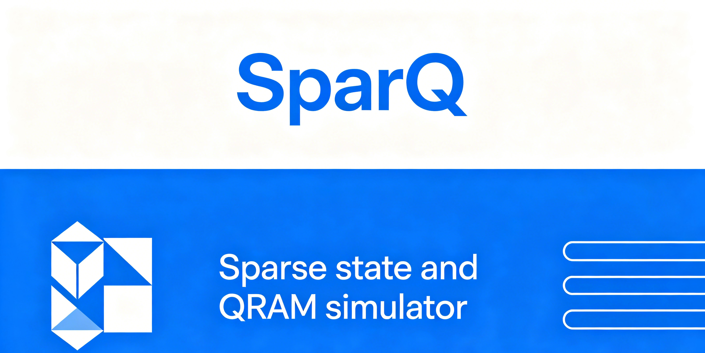

<p align="center">
  
</p>

English | [简体中文](README.zh-CN.md)

# QRAM-Simulator

[](https://arxiv.org/abs/2503.13832)
[](https://arxiv.org/abs/2503.15118)
[](https://opensource.org/licenses/Apache-2.0)
[](https://github.com/IAI-USTC-Quantum/QRAM-Simulator)
[](https://github.com/IAI-USTC-Quantum/QRAM-Simulator/actions/workflows/cmake-multi-platform.yml)
[](https://iai-ustc-quantum.github.io/QRAM-Simulator/)

> **QRAM circuit simulation core (C++ base repository)**: two QRAM architectures (Qutrit/Qubit), noise models, QRAM paper experiments, and pybind11 Python bindings

## Repository Split

This repository is the C++ base: QRAM circuit core + paper experiments + **pybind11 thin bindings** (the `qram-simulator` PyPI package); the SparQ framework (sparse-state simulator, algorithm library, pysparq rich bindings, and algorithm experiments) lives in the SparQSim repository:

| Repository | Contents | PyPI Package |
|------|------|---------|
| **QRAM-Simulator** (this repository) | C++ QRAM circuit core (Common + QRAM) + QRAM paper experiments + pybind11 thin bindings | `qram-simulator` |
| [SparQSim](https://github.com/IAI-USTC-Quantum/SparQSim) | SparQ framework (sparse-state simulator, algorithm library, pysparq rich bindings, algorithm experiments) | `pysparq` |

Dependency direction: **SparQSim → QRAM-Simulator**. SparQSim consumes this repository as a git submodule (relative URL `../QRAM-Simulator.git`) and builds the C++ core; the two repositories are tagged and released independently, and before a SparQSim release the submodule is pinned to the corresponding tag of this repository.

## Core Capabilities

- **QRAM circuit simulation**: two implementations, Qutrit-based (`qram_circuit_qutrit.h`) and Qubit-based (`qram_circuit_qubit.h`)
- **Noise models**: depolarizing (Depolarizing) and amplitude damping (Damping), with probability parameter range validation
- **Architecture pruning**: the qubit architecture's normal (pruned) mode and full (unpruned) mode are cross-checked version by version
- **Common components**: sparse/dense matrices, random engines, error handling, state manipulators, and more

## C++ Quick Start

### Build

```bash
git clone https://github.com/IAI-USTC-Quantum/QRAM-Simulator.git
cd QRAM-Simulator
mkdir build && cd build

# Configure (CPU build; the GPU/CUDA backend is on hold for now, CMake builds a CPU-only version)
cmake .. -DCMAKE_BUILD_TYPE=Release

make -j$(nproc)
```

Build options (each controllable via `-D...=ON/OFF`):

| Option | Default | Description |
|------|------|------|
| `QRAM_BUILD_TESTS` | ON | Build the C++ tests (test/) |
| `QRAM_BUILD_EXPERIMENTS` | ON | Build the QRAM experiment programs (Experiments/) |

### Core Usage

```cpp
#include "qram_circuit_qubit.h"

using namespace qram_simulator;
using namespace qram_qubit;

// 1. Construct the QRAM circuit (addr_size=4, data_size=2)
QRAMCircuit qram(4, 2);
qram.set_memory_random();                     // random data tree

// 2. Inject noise (optional; probability range validation, Damping requires gamma < 1)
qram.set_noise_models({
    { OperationType::Depolarizing, 1e-3 },
    { OperationType::Damping, 1e-4 }
});

// 3. Run (normal = architecture pruning / full = unpruned baseline)
qram.set_input_uniform(100);
qram.run_normal();

// 4. Sample the fidelity
double fidelity = qram.sample_and_get_fidelity();
```

## Python Quick Start

```bash
pip install qram-simulator
```

The binding layer (`bindings/python/`, pybind11) exports the core working classes: `QRAMCircuitQubit` / `QRAMCircuitQutrit` (the two architecture circuits), `QRAMFullAmp` (full-amplitude bridge), `TimeStep` (time-step and noise scheduling), `OperationType`, and global random-seed control, so external libraries can drive the full construct → set noise → run → fidelity workflow directly:

```python
from qram_simulator import QRAMCircuitQubit, OperationType, set_seed

set_seed(42)
qram = QRAMCircuitQubit(4, 2)
qram.set_memory_random()
qram.set_noise_models({OperationType.Depolarizing: 1e-3,
                       OperationType.Damping: 1e-4})
qram.set_input_uniform(100)
qram.run_normal()
print(qram.sample_and_get_fidelity())
```

Local development: `pip install -v .` (CMake >= 3.18 + C++17 + OpenMP); tests: `pytest bindings/python/test`.

### Circuit-Level Baseline (UnifiedQuantum)

`pip install "qram-simulator[baseline]"` additionally enables `qram_simulator.baseline`: a gate-level (circuit-level) re-implementation of the qubit-architecture QRAM on the [UnifiedQuantum](https://github.com/IAI-USTC-Quantum/UnifiedQuantum) (uniqc) QuTiP density-matrix backend, supporting 1-2 tree layers, with noise channels placed on the QRAM routing tree only. It cross-checks `QRAMCircuitQubit` semi-quantitatively under convention-identical fidelity metrics:

```bash
python -m qram_simulator.baseline.compare --addr 2 --runs 500 --outdir results
```

See [bindings/python/qram_simulator/baseline/README.md](bindings/python/qram_simulator/baseline/README.md) for the encoding/noise conventions and [results.md](bindings/python/qram_simulator/baseline/results.md) for the packaged run (noise-free bridge at machine precision; F_cls ≥ 0.9988, TVD ≤ 0.026 and `⟨ψ|ρ|ψ⟩` = `E|⟨ψ|ψ_traj⟩|²` within Monte Carlo error over the full noise sweep).

### Consuming as a CMake Subproject (the SparQSim Way)

```cmake
# submodule: git submodule add ../QRAM-Simulator.git extern/qram-simulator
set(QRAM_BUILD_TESTS OFF CACHE BOOL "" FORCE)
set(QRAM_BUILD_EXPERIMENTS OFF CACHE BOOL "" FORCE)
add_subdirectory(extern/qram-simulator)   # provides the SparQ_QRAMSimulator / SparQ_Common targets and the flattened header layout
```

### Running Experiments

```bash
# QRAM fidelity experiment (V2)
./build/bin/Experiment_QRAM_FidelityV2 ...
```

For the Python side (pysparq full-featured rich bindings and the qram_simulator thin bindings), see the [SparQSim](https://github.com/IAI-USTC-Quantum/SparQSim) repository.

## Papers and Citation

This repository is driven by two papers:

### Paper 1: QRAM-Simulator — [arXiv:2503.13832](https://arxiv.org/abs/2503.13832)

> *Efficient Simulation of Quantum Random Access Memory*

- **QRAM circuit simulation**: Qutrit-based and Qubit-based QRAM implementations (C++ API) with depolarizing and amplitude damping noise models
- **Sparse-state optimization**: stores only non-zero amplitudes, enabling simulation of structured algorithms with 64+ qubits
- **Error filtering**: error filtering schemes for noisy QRAM

**Corresponding code**: `QRAM/`, `Experiments/QRAM/` (the error-filtering experiments live in the SparQSim repository)

### Paper 2: SparQ — [arXiv:2503.15118](https://arxiv.org/abs/2503.15118)

> *SparQ: A Sparse Quantum Circuit Simulator with Register-Level Abstraction*

Extends Register Level Programming into a general-purpose sparse-state quantum simulator (QFT, Grover, Hamiltonian simulation, QDA, QCNN, and other algorithms, plus an extended algorithm library).

**Corresponding code**: `SparQ/`, `SparQ_Algorithm/`, and the algorithm experiments have been migrated to the [SparQSim](https://github.com/IAI-USTC-Quantum/SparQSim) repository.

### BibTeX

```bibtex
@article{sun2025sparqsim,
  title={SparQSim: Simulating Scalable Quantum Algorithms via Sparse Quantum State Representations},
  author={Sun, Tai-Ping and Chen, Zhao-Yun and Wang, Yun-Jie and Xue, Cheng and Liu, Huan-Yu and Zhuang, Xi-Ning and Xu, Xiao-Fan and Wu, Yu-Chun and Guo, Guo-Ping},
  journal={arXiv preprint arXiv:2503.15118},
  year={2025}
}

@article{wang2025refined,
  title={Refined Criteria for QRAM Error Suppression via Efficient Large-Scale QRAM Simulator},
  author={Wang, Yun-Jie and Sun, Tai-Ping and Zhuang, Xi-Ning and Xu, Xiao-Fan and Liu, Huan-Yu and Xue, Cheng and Wu, Yu-Chun and Chen, Zhao-Yun and Guo, Guo-Ping},
  journal={arXiv preprint arXiv:2503.13832},
  year={2025}
}
```

### Reproducing the Paper Results

Detailed guides for reproducing the experiments live in the [docs/sphinx/source/en/paper/](docs/sphinx/source/en/paper/) directory:

- [docs/sphinx/source/en/paper/README.md](docs/sphinx/source/en/paper/README.md) - paper-related documentation
- [docs/sphinx/source/en/paper/reproduction.md](docs/sphinx/source/en/paper/reproduction.md) - [QRAM-Simulator](https://arxiv.org/abs/2503.13832) experiment reproduction guide

## Project Structure

```
QRAM-Simulator/
├── QRAM/               # QRAM circuit implementations (Qutrit/Qubit-based)
├── Common/             # common components (matrices, random engines, state manipulators, etc.)
├── bindings/python/    # pybind11 thin bindings (the qram-simulator PyPI package)
├── Experiments/        # QRAM paper experiments (QRAMFidelityV2, QubitPaper, ChannelCorrespondence, etc.)
├── test/               # C++ tests (the Common/QRAM portions)
├── ThirdParty/         # vendored dependencies (Eigen, fmt, googletest, argparse)
└── docs/               # Sphinx docs (breathe pulls in the Doxygen C++ API + autoapi Python API)
```

## Release Process

1. Merge changes into main on Gitea (the primary development repository);
2. Sync to the GitHub upstream `IAI-USTC-Quantum/QRAM-Simulator`;
3. Update `CHANGELOG.md` and tag (`vX.Y.Z`; note that v0.1.x already exists historically, the new series starts at v0.2.0);
4. Push the tag or create a GitHub Release → `pypi-publish.yml` automatically builds cp310-cp313 manylinux / win_amd64 wheels and the sdist, and publishes the `qram-simulator` package via PyPI trusted publishing; `pysparq` is still released from the SparQSim repository.

## About Us

This project is developed by **[IAI-USTC Quantum](https://github.com/IAI-USTC-Quantum)**.

- **GitHub Organization**: [IAI-USTC-Quantum](https://github.com/IAI-USTC-Quantum) — browse all of the team's open-source projects
- **Documentation**: [iai-ustc-quantum.github.io](https://iai-ustc-quantum.github.io/) — team documentation and project homepages

IAI-USTC Quantum is the quantum artificial intelligence team at the Institute of Artificial Intelligence, Hefei Comprehensive National Science Center.

Main developers: Agony5757 (chenzhaoyun@iai.ustc.edu.cn), RichardSun, Itachixc, YunJ1e, cilysad, TMYTiMidlY

## Related Projects

- [SparQSim](https://github.com/IAI-USTC-Quantum/SparQSim) - the SparQ framework and Python ecosystem (pysparq)
- [UnifiedQuantum](https://github.com/IAI-USTC-Quantum/UnifiedQuantum) - a unified quantum computing framework

## License

Apache-2.0 License
